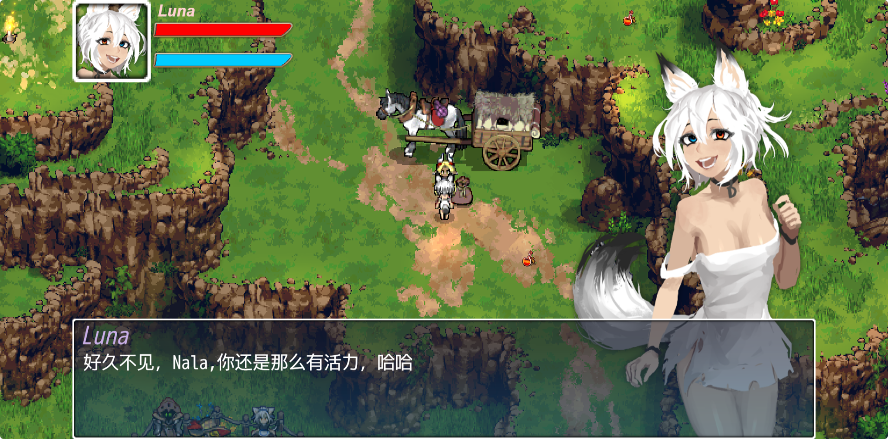
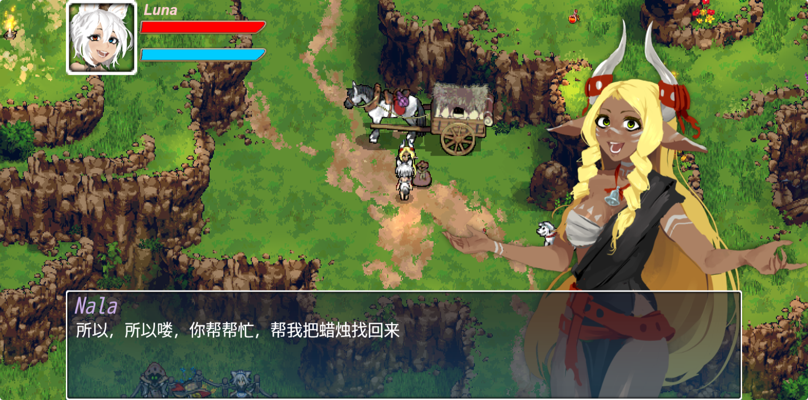
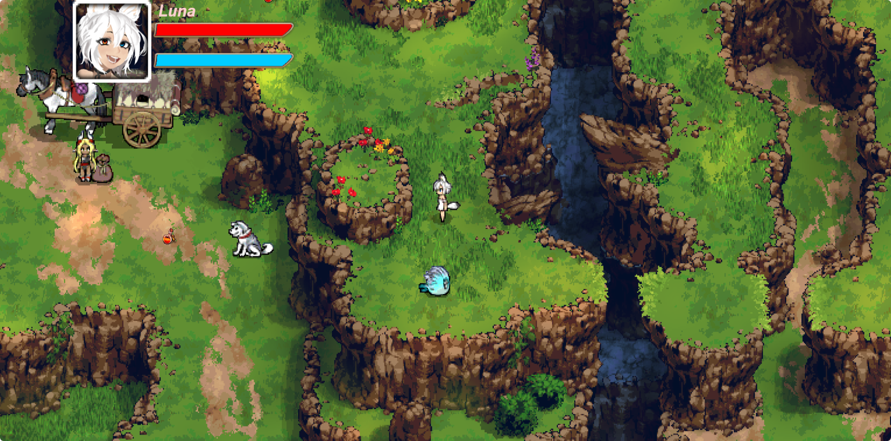
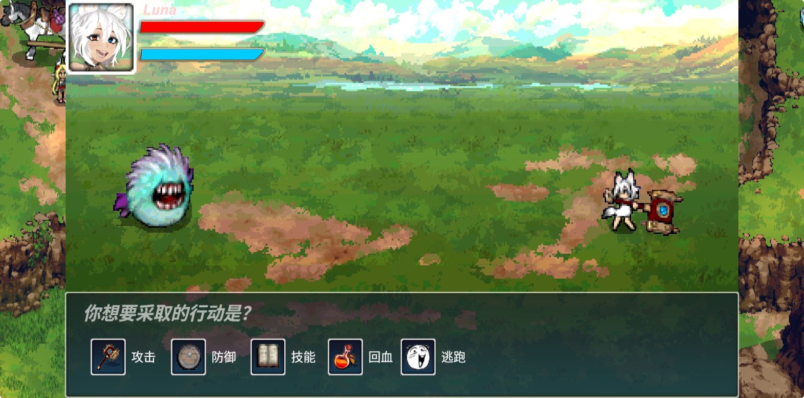
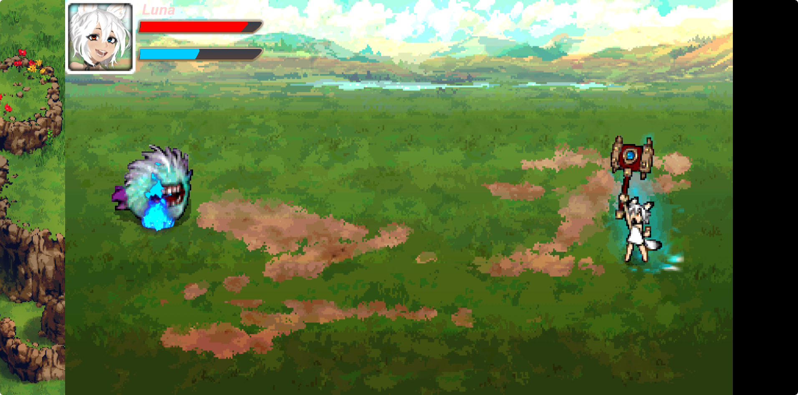

# Luna's Fantasy

基于 **Cocos Creator 3.x + TypeScript** 开发的 2D 像素风横版冒险 RPG 小游戏，支持微信小游戏平台发布。

  

## 游戏特性

  

- **探索系统**  开放地图自由探索，Lerp 平滑相机跟随，地图边界限制
- **NPC 交互**  基于碰撞检测的对话触发，支持条件分支对话推进
- **物品收集**  蜡烛收集、药水回复，拾取特效与音效反馈
- **回合制战斗**  攻击 / 防御 / 技能 / 回复 / 逃跑，Tween 动画驱动战斗演出

  

## 技术实现

  

| 模块 | 技术方案 |
|------|----------|
| 角色移动 | RigidBody2D + FixedUpdate 固定时间步长，支持 Shift 加速 |
| 碰撞系统 | Collider2D + Contact2DType 回调，碰撞分组优化检测 |
| 战斗系统 | Tween 动画 + async/await 异步时序控制 |
| 动画管理 | AnimationController 状态机，代码驱动状态切换 |
| 相机跟随 | Lerp 平滑插值 + 地图边界 clamp |
| 全局状态 | 单例模式 GameManager，BGM / UI / 战斗状态统一管理 |

  

## 技术栈

`Cocos Creator 3.x`  `TypeScript`  `2D Physics`  `Tween Animation`  `Animation State Machine`